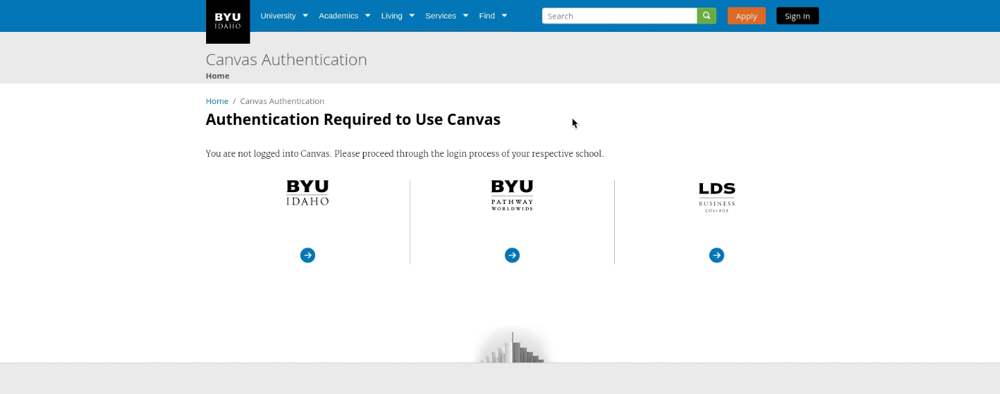

```{r, echo=FALSE}
knitr::opts_chunk$set(echo = FALSE, message = FALSE, warning = FALSE)
```

```{r load_libraries, include=FALSE}
# Use this R-Chunk to load all your libraries!
#install.packages("tidyverse") # run this line once in console to get package
library(tidyverse)
Canvas <- read_csv("canvas connection data2.csv")
Canvas$City <- factor(Canvas$City)
```




####Data Comparison for DNS lookup, TCP connect, Secure connect, request, and page load time in above webpage. 


```{r}
ggplot(Canvas %>% group_by(City), aes(x = fct_rev(fct_reorder(City, DNS_lookup)), y = DNS_lookup)) +
  geom_point() +
  labs(y = "DNS Lookup time in ms", subtitle = "1 second = 1000 ms", title = "DNS Lookup Time Comparison by Country", x = "City") +
  theme_bw() +
  theme(axis.text.x = element_text(angle = 20, vjust = 1, hjust = 1))
```

```{r}
ggplot(Canvas %>% group_by(City), aes(x = fct_rev(fct_reorder(City, TCP_connect)), y = TCP_connect)) +
  geom_point() +
  labs(y = "TCP Connect time in ms", subtitle = "1 second = 1000 ms", title = "TCP Connect Time Comparison by Country", x = "City") +
  theme_bw() +
  theme(axis.text.x = element_text(angle = 20, vjust = 1, hjust = 1))
```

```{r}
ggplot(Canvas %>% group_by(City), aes(x = fct_rev(fct_reorder(City, Secure_connect)), y = Secure_connect)) +
  geom_point() +
  labs(y = "Secure Connect time in ms", subtitle = "1 second = 1000 ms", title = "Secure Connect Time Comparison by Country", x = "City") +
  theme_bw() +
  theme(axis.text.x = element_text(angle = 20, vjust = 1, hjust = 1))
```

```{r}
ggplot(Canvas %>% group_by(City), aes(x = fct_rev(fct_reorder(City, request)), y = request)) +
  geom_point() +
  labs(y = "Request time in ms", subtitle = "1 second = 1000 ms", title = "Request Time Comparison by Country", x = "City") +
  theme_bw() +
  theme(axis.text.x = element_text(angle = 20, vjust = 1, hjust = 1))
```

```{r}
ggplot(Canvas %>% group_by(City), aes(x = fct_rev(fct_reorder(City, Page_Load_Time)), y = Page_Load_Time)) +
  geom_point() +
  labs(y = "Page Load time in Seconds", title = "Page Load Time Comparison by Country", x = "City") +
  theme_bw() +
  geom_hline(aes(yintercept = 3, color = "firebrick")) +
  theme(axis.text.x = element_text(angle = 20, vjust = 1, hjust = 1), legend.position = "none")
```


